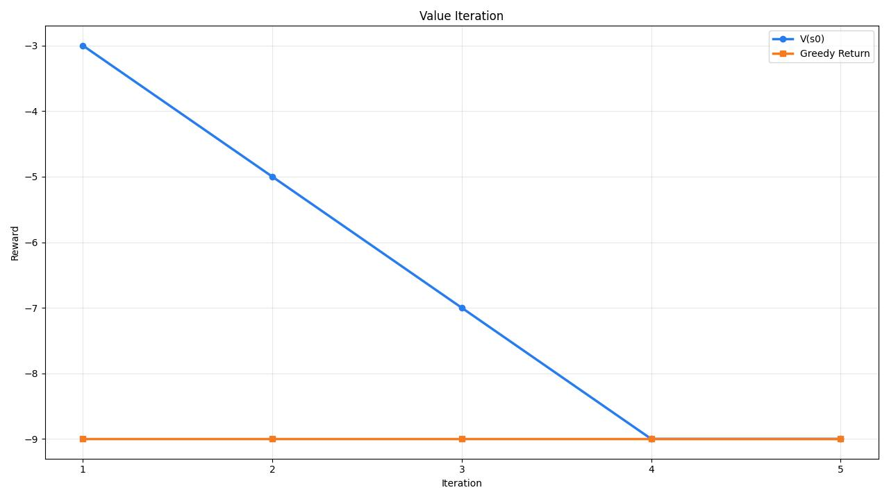

# Задание 3. Демонстрация работы обученной стратегии

Для демонстрации использовался скрипт [`task_2.py`](./task_2.py). Он:

- обучает стратегию алгоритмом `Value Iteration`;
- восстанавливает оптимальную политику;
- выполняет инференс на нескольких конфигурациях поля;
- сохраняет график обучения в файл `value_iteration_progress.jpeg`.

## 1. График сходимости



Что показано на графике:

- синяя линия `V0` — оценка функции ценности начального состояния `s0 = (0, 0, 0, 0)` из варианта 2;
- оранжевая линия `Greedy Return` — полный reward маршрута, если на каждой итерации брать жадную стратегию по текущей `Value Function`.

Наблюдения:

- алгоритм сошелся за `5` итераций;
- итоговое значение `V(s0) = -9`;
- полный reward оптимального маршрута для базового поля тоже равен `-9`;
- жадная политика стала давать оптимальный маршрут уже с первой итерации, а последующие итерации уточнили значения промежуточных состояний и довели `V(s0)` до точного оптимума.

Это ожидаемо для данной среды: MDP детерминированный, а горизонт эпизода конечный и равен четырем заказам.

## 2. Маршруты на разных вариантах поля

Ниже `x` — финальная позиция такси, а символы `.` показывают пройденный путь. Для самопроверки найденные порядки дополнительно совпали с полным перебором всех `4! = 24` возможных последовательностей заказов.

### Базовая конфигурация

- Оптимальный порядок: `A->a -> B->b -> C->c -> D->d`
- Суммарный reward: `-9`
- Длина пути: `9` клеток

```text
+---+---+---+---+---+---+---+
| . |   |   |   |   |   |   |
+---+---+---+---+---+---+---+
| . | A | a |   |   |   |   |
+---+---+---+---+---+---+---+
|   |   | B | b |   |   |   |
+---+---+---+---+---+---+---+
|   |   |   | C | c |   |   |
+---+---+---+---+---+---+---+
|   |   |   |   | D |   |   |
+---+---+---+---+---+---+---+
|   |   |   |   | x |   |   |
+---+---+---+---+---+---+---+
|   |   |   |   |   |   |   |
+---+---+---+---+---+---+---+
```

Интерпретация: на базовом поле выгоднее ехать по диагонали снизу вверх по естественному порядку `A, B, C, D`, потому что каждая следующая посадка и высадка лежит рядом с предыдущей точкой завершения заказа.

### Конфигурация `northern_hub`

- Оптимальный порядок: `B->b -> A->a -> D->d -> C->c`
- Суммарный reward: `-23`
- Длина пути: `23` клетки

```text
+---+---+---+---+---+---+---+
| . | . | b | . | . | A |   |
+---+---+---+---+---+---+---+
| . | B |   |   |   | . |   |
+---+---+---+---+---+---+---+
|   |   |   |   |   | . | a |
+---+---+---+---+---+---+---+
|   |   |   |   |   |   | . |
+---+---+---+---+---+---+---+
|   |   |   |   |   |   | d |
+---+---+---+---+---+---+---+
|   |   | C | . | . | . | . |
+---+---+---+---+---+---+---+
|   | x | . |   |   |   | D |
+---+---+---+---+---+---+---+
```

Интерпретация: сначала выгодно забрать ближайший к старту заказ `B->b`, затем пройти к северо-восточному кластеру `A->a`, и только после этого опуститься вниз к дальним заказам `D` и `C`.

### Конфигурация `cross_city`

- Оптимальный порядок: `C->c -> A->a -> D->d -> B->b`
- Суммарный reward: `-26`
- Длина пути: `26` клеток

```text
+---+---+---+---+---+---+---+
| . |   |   |   |   | . | B |
+---+---+---+---+---+---+---+
| . |   |   |   |   | d | . |
+---+---+---+---+---+---+---+
| . | . | . | C |   | . | x |
+---+---+---+---+---+---+---+
|   |   |   | . |   | . |   |
+---+---+---+---+---+---+---+
|   | c | . | . |   | . |   |
+---+---+---+---+---+---+---+
|   | . | . | . | . | D |   |
+---+---+---+---+---+---+---+
| A | . | a |   |   |   |   |
+---+---+---+---+---+---+---+
```

Интерпретация: здесь сначала выгодно обслужить центральный заказ `C->c`, затем перейти в нижний левый угол к `A->a`, после чего маршрут уходит вверх вправо к `D->d` и заканчивается дальним заказом `B->b`.

## 3. Вывод

Одна и та же реализация `Value Iteration` корректно пересчитывает оптимальный порядок развоза для разных конфигураций поля. Это видно и по графику сходимости, и по тому, что на разных вариантах расположения точек получаются разные оптимальные маршруты и разные значения итогового reward.
