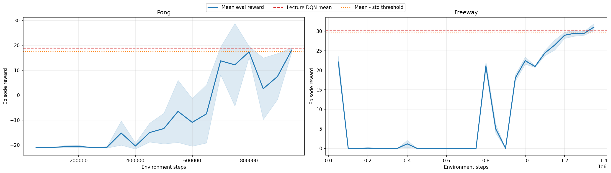

# HW2: DQN on Atari (`Pong` + `Freeway`)

В этом задании выбраны две среды Atari:

- `Pong` как обязательная и одна из самых простых для DQN.
- `Freeway` как вторая игра из таблицы лекции.

Основной код находится в файле [dqn_atari_homework.py](/home/nortlite/mipt/mipt_RL/hw2/dqn_atari_homework.py).

## Что в итоге получилось

Полный запуск из `hw2/artifacts` завершился успешно на `cuda`, и обе игры достигли целевого порога `DQN mean - std` из таблицы лекции:

- `Pong`: порог `17.6`, лучший eval score `18.1`, финальный `18.3 ± 1.19`.
- `Freeway`: порог `29.6`, лучший eval score `31.05`, финальный `30.8 ± 1.03`.

Итог по артефактам:

| Game | Configured max steps | Actual stop step | Success threshold | Best eval mean | Final eval mean ± std | Solved |
|---|---:|---:|---:|---:|---:|---:|
| Pong | 2,000,000 | 950,000 | 17.6 | 18.1 | 18.3 ± 1.19 | Yes |
| Freeway | 3,000,000 | 1,350,000 | 29.6 | 31.05 | 30.8 ± 1.03 | Yes |

Обучение остановилось раньше максимального числа шагов, потому что в коде используется `StopTrainingOnRewardThreshold`: как только средний `eval` пересекает порог, запуск досрочно завершается.

## Что реализовано

- классический `DQN` для `Pong`;
- усиленный `DQN` для `Freeway`;
- `replay buffer`;
- `target network`;
- `frame skip = 4`;
- стек из `4` последних кадров;
- `epsilon-greedy` исследование;
- reward clipping на обучении и оценка на необрезанных наградах;
- периодический `evaluation` во время обучения с сохранением моделей, логов и графиков.

Для `Freeway` добавлены улучшения из развития DQN/Rainbow:

- `Double DQN`;
- `dueling network`;
- `prioritized replay`;
- `n-step return (n = 3)`.

Это оказалось критично: по диагностике в артефактах тривиальная стратегия `always UP` даёт для `Freeway` примерно `22.0 ± 1.97`. Старый агент упирался примерно в тот же уровень, то есть фактически не превосходил baseline. Исправленная модель поднялась до `31.05`, то есть уже действительно научилась играть.

## Гиперпараметры полного запуска

### Pong

| Parameter | Value |
|---|---:|
| Total timesteps | 2,000,000 |
| Replay buffer | 80,000 |
| Learning starts | 20,000 |
| Eval freq | 50,000 |
| Eval episodes | 10 |
| Learning rate | 1e-4 |
| Batch size | 32 |
| Gamma | 0.99 |
| Train freq | 4 |
| Gradient steps | 1 |
| Target update interval | 10,000 |
| Exploration fraction | 0.10 |
| Exploration final eps | 0.01 |
| Frame stack | 4 |
| Optimizer | Adam |

### Freeway

| Parameter | Value |
|---|---:|
| Total timesteps | 3,000,000 |
| Replay buffer | 120,000 |
| Learning starts | 50,000 |
| Eval freq | 50,000 |
| Eval episodes | 20 |
| Learning rate | 1e-4 |
| Batch size | 32 |
| Gamma | 0.99 |
| Train freq | 4 |
| Gradient steps | 1 |
| Target update interval | 8,000 |
| Exploration fraction | 0.40 |
| Exploration final eps | 0.02 |
| Frame stack | 4 |
| Optimizer | Adam(`eps=1.5e-4`) |
| N-step | 3 |
| Double DQN | True |
| Dueling | True |
| Prioritized replay | True |
| Terminal on life loss | False |

## Почему `Freeway` удалось решить

- Основной проблемой неудачных запусков была не просто в недообучении, а в том, что агент застревал около trivial baseline `always UP`.
- У `Freeway` разреженная награда, поэтому простого vanilla-DQN оказалось недостаточно.
- `prioritized replay` помог чаще дообучаться на редких полезных переходах.
- `Double DQN` уменьшил переоценку Q-значений.
- `Dueling` дал более устойчивую аппроксимацию в среде с очень маленьким action space.

По кривой обучения видно, что настоящий прорыв в `Freeway` случился поздно: после долгого нестабильного участка агент вышел на `28.95` к `1.2M` шагов и впервые пересёк целевой порог на `1.35M`, достигнув `31.05`.

## Критерий успеха

Считаю игру решённой, если средний evaluation score достигает нижней границы `DQN mean - std` из таблицы лекции:

- `Pong`: `18.9 - 1.3 = 17.6`
- `Freeway`: `30.3 - 0.7 = 29.6`

Сам скрипт рисует на графиках две горизонтальные линии:

- средний `DQN` score из таблицы лекции;
- нижнюю границу `mean - std`.

## Как запускать

Быстрая smoke-проверка, для проверки работоспособности кода:

```bash
uv run python hw2/dqn_atari_homework.py --smoke-test
```

Полный запуск:

```bash
uv run python hw2/dqn_atari_homework.py
```

Запуск только одной игры:

```bash
uv run python hw2/dqn_atari_homework.py --games Freeway
```

Скрипт сам выбирает `cuda`, если она доступна. Полный запуск, результаты которого лежат в `hw2/artifacts`, был выполнен на `cuda`.

## Артефакты

После запуска скрипт сохраняет:

- `hw2/artifacts/models/` — последние и лучшие модели;
- `hw2/artifacts/eval_logs/` — история периодических evaluation;
- `hw2/artifacts/plots/` — отдельные и общий график обучения;
- `hw2/artifacts/dqn_summary.csv` — итоговая таблица по играм;
- `hw2/artifacts/dqn_summary.json` — та же сводка в JSON.

## График сходимости

Ниже подключён общий график полного запуска:



На графике видно:

- устойчивый рост качества в `Pong` до решённой игры;
- поздний, но успешный выход `Freeway` выше целевого порога;
- разброс по evaluation episodes через полосу `±1 std`.

## Выводы

- Для `Pong` хватает классического `DQN` с базовыми Atari-техниками.
- Для `Freeway` vanilla-DQN оказался слишком слабым: он почти повторял стратегию `always UP`.
- Улучшения из семейства Rainbow в этой задаче были не декоративными, а необходимыми: именно они позволили выйти с `~22` к `31+`.
- По итоговым артефактам домашнее задание можно считать выполненым: обе игры достигли требуемых метрик из таблицы лекции.
